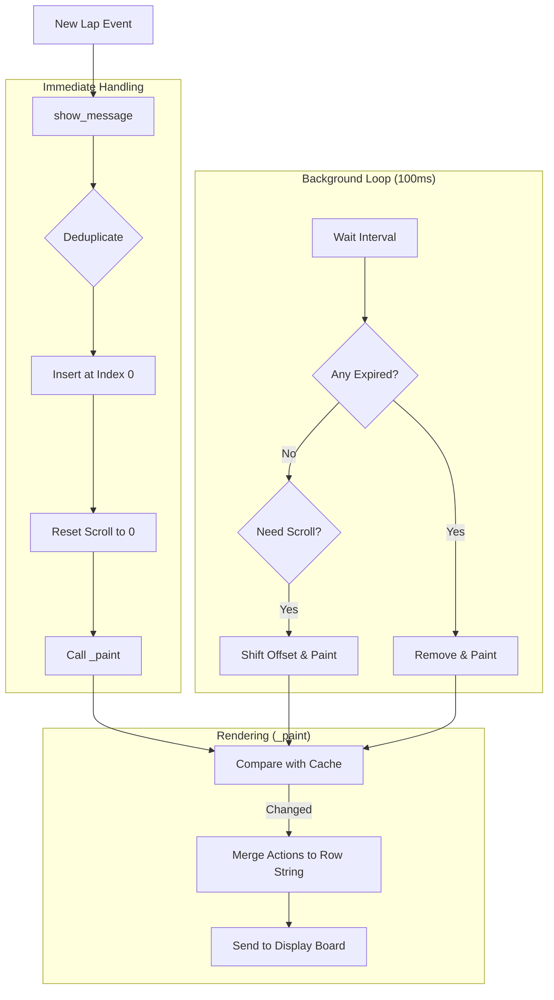

# Lap Arrival & Pagination Pipeline

This document explains how a new lap event is processed and managed by the `PaginationManager` to be displayed on the screen.

## Overview
The pipeline follows a **"Push-Immediate, Pull-Maintenance"** pattern. New data is pushed immediately to the display, while a background thread handles rotation (scrolling) and expiration.

## 1. The Entrance: `show_message`
When a lap is detected, the `show_message()` method is triggered with a list of "actions" (text clusters to display).

1.  **Identification**: It extracts a `key` (usually the bib number) from the first action.
2.  **Deduplication**: If that athlete was already on the board, their old record is removed.
3.  **Priority**: The new result is inserted at the **top (index 0)** of the active list.
4.  **Focus**: Scrolling is reset to `offset = 0` so the NEW entry is guaranteed to be visible.
5.  **Trigger**: An immediate `_paint()` is called to update the hardware board instantly.

## 2. The Maintenance: `_run_loop`
A background thread runs every 100ms to keep the display dynamic:

*   **Expiration**: It checks the `arrival_time` of every entry. If it's older than 15 seconds (default), it's removed.
*   **Scrolling**: If there are 5 athletes but only 2 rows, it waits 2 seconds and then shifts the view (increments `scroll_offset`).
*   **Cleanup**: If the list becomes empty, it clears the board.

## 3. The Renderer: `_paint`
This is where the logical list of athletes becomes actual text on the hardware:

1.  **Windowing**: It picks the $N$ athletes starting from the current `scroll_offset`.
2.  **Diffing**: It compares the new "intended state" with the `last_display_state`. If nothing changed, it cancels the update to save bandwidth.
3.  **Buffering**: It merges multiple small text blocks into a single 80-character row string.

---

## Technical Flow Diagram

## Summary of Constants
- **Max Age**: 15s (How long a lap stays "active").
- **Rotation Interval**: 2s (How fast the pages turn).
- **Refresh Rate**: 0.1s (How often the manager checks for expiration).
